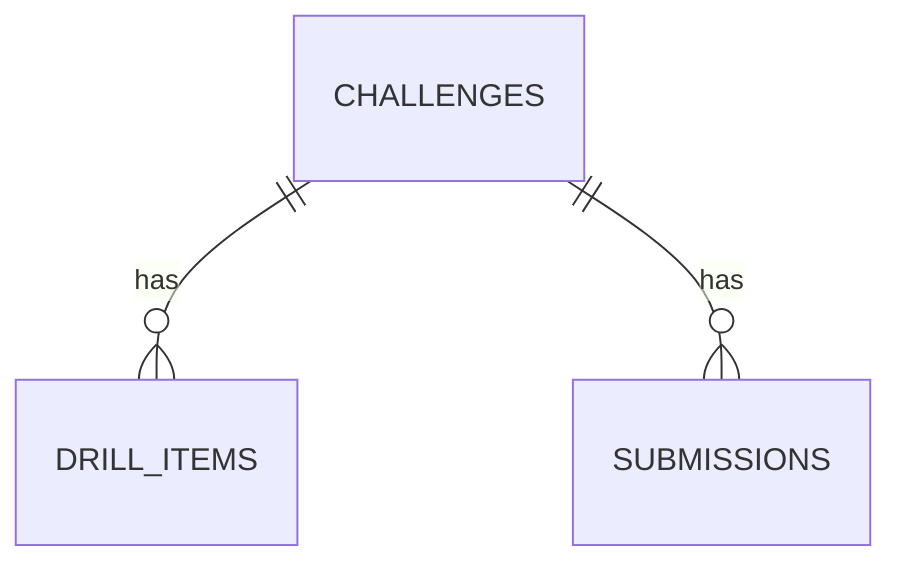

# CodeForge Database Schema (PostgreSQL)

_Last updated: 2026-02-13_

This document describes the active schema model used by the app with Hibernate + PostgreSQL (Neon in production).

## Overview
Core tables:
- `challenges`
- `drill_items`
- `submissions`

Core enums (stored as strings):
- `Difficulty`: `EASY`, `MEDIUM`, `HARD`
- `Outcome`: `CORRECT`, `ACCEPTABLE`, `INCORRECT`, `SKIPPED`

## Entity relationship


## Table notes

### challenges
- `id BIGINT` primary key (identity)
- `title VARCHAR(255)` unique, not null
- `difficulty VARCHAR(20)` not null
- `blurb TEXT`
- `prompt_md TEXT`
- `expected_answer TEXT`
- `created_at TIMESTAMP`
- `updated_at TIMESTAMP`

### drill_items
- `id BIGINT` primary key (identity)
- `version BIGINT` optimistic lock (`@Version`)
- `challenge_id BIGINT` FK -> `challenges(id)`, not null
- `user_id VARCHAR(64)` not null
- `times_seen INT` not null, default 0
- `streak INT` not null, default 0
- `next_due_at TIMESTAMP` nullable
- `created_at TIMESTAMP`
- `updated_at TIMESTAMP`

### submissions
- `id BIGINT` primary key (identity)
- `challenge_id BIGINT` FK -> `challenges(id)`, not null
- `user_id VARCHAR(64)` not null
- `outcome VARCHAR(20)` not null
- `code TEXT`
- `created_at TIMESTAMP`
- `updated_at TIMESTAMP`

## PostgreSQL reset script (no seed data)
```sql
DROP TABLE IF EXISTS submissions;
DROP TABLE IF EXISTS drill_items;
DROP TABLE IF EXISTS challenges;

CREATE TABLE challenges (
  id BIGINT GENERATED BY DEFAULT AS IDENTITY PRIMARY KEY,
  title VARCHAR(255) NOT NULL UNIQUE,
  difficulty VARCHAR(20) NOT NULL,
  blurb TEXT,
  prompt_md TEXT,
  expected_answer TEXT,
  created_at TIMESTAMP,
  updated_at TIMESTAMP
);

CREATE TABLE drill_items (
  id BIGINT GENERATED BY DEFAULT AS IDENTITY PRIMARY KEY,
  version BIGINT,
  challenge_id BIGINT NOT NULL REFERENCES challenges(id),
  user_id VARCHAR(64) NOT NULL,
  times_seen INT NOT NULL DEFAULT 0,
  streak INT NOT NULL DEFAULT 0,
  next_due_at TIMESTAMP,
  created_at TIMESTAMP,
  updated_at TIMESTAMP
);

CREATE TABLE submissions (
  id BIGINT GENERATED BY DEFAULT AS IDENTITY PRIMARY KEY,
  challenge_id BIGINT NOT NULL REFERENCES challenges(id),
  user_id VARCHAR(64) NOT NULL,
  outcome VARCHAR(20) NOT NULL,
  code TEXT,
  created_at TIMESTAMP,
  updated_at TIMESTAMP
);

CREATE INDEX idx_drill_items_user_due ON drill_items (user_id, next_due_at);
CREATE INDEX idx_submissions_challenge_user ON submissions (challenge_id, user_id);
```

## Migration guidance
- Use PostgreSQL-compatible DDL only.
- Keep enum values in sync with Java enums.
- Post-MVP migration tooling (e.g., Flyway) should baseline this schema and apply forward-only changes.
