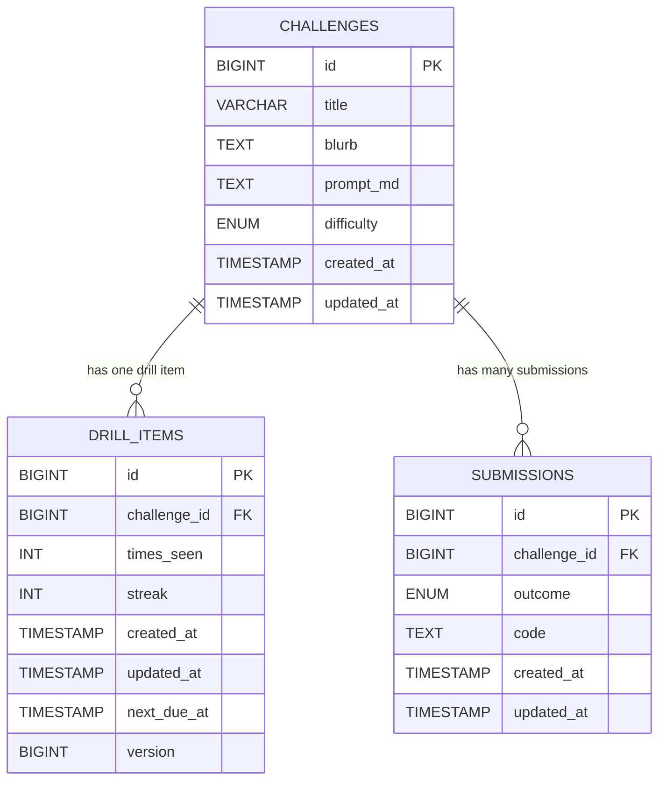

# 📘 CodeForge Database Schema
### _DBSchema.md_
_Last updated: 11-27-2025

## 📌 Overview
This document defines the **relational data model** for the CodeForge application, including:

- Table structures  
- Relationships  
- Constraints  
- ENUM values  
- Timestamp behavior  
- Indexing strategy  
- Hibernate/JPA interactions  
- Guidance for future migrations  

This schema is used across **local dev**, **test environments**, and **production deployments**.

---

## 🗺️ Entity-Relationship Diagram (ERD)



---

## 🔧 Tables & Definitions

### 🟥 1. challenges
Stores all coding challenges used in Practice Mode & Drill Mode.

| Column     | Type                                                                     | Notes                     |
|------------|--------------------------------------------------------------------------|---------------------------|
| id         | BIGINT PK AUTO_INCREMENT                                                 | Primary key               |
| title      | VARCHAR(255) NOT NULL                                                    | Must be unique            |
| blurb      | TEXT                                                                     | Short description         |
| prompt_md  | TEXT                                                                     | Markdown prompt text      |
| difficulty | ENUM('EASY','MEDIUM','HARD') NOT NULL                                    | Difficulty classification |
| created_at | TIMESTAMP NOT NULL DEFAULT CURRENT_TIMESTAMP                             | Creation time             |
| updated_at | TIMESTAMP NOT NULL DEFAULT CURRENT_TIMESTAMP ON UPDATE CURRENT_TIMESTAMP | Last modification         |

**Constraints:**  
- UNIQUE KEY uk_challenges_title (title)

---

### 🟧 2. drill_items
Tracks challenges in the user’s Drill Queue.

| Column       | Type                                                            | Notes                        |
|--------------|-----------------------------------------------------------------|------------------------------|
| id           | BIGINT PK AUTO_INCREMENT                                        | Unique queue entry           |
| challenge_id | BIGINT FK                                                       | Linked challenge             |
| times_seen   | INT DEFAULT 0                                                   | Number of times seen         |
| streak       | INT DEFAULT 0                                                   | Consecutive correct answers  |
| created_at   | TIMESTAMP DEFAULT CURRENT_TIMESTAMP                             | Created                      |
| updated_at   | TIMESTAMP DEFAULT CURRENT_TIMESTAMP ON UPDATE CURRENT_TIMESTAMP | Updated                      |
| next_due_at  | TIMESTAMP NULL                                                  | Scheduling timestamp         |
| version      | BIGINT                                                          | Hibernate optimistic locking |

**Constraints:**  
- UNIQUE(challenge_id)  
- FOREIGN KEY → challenges(id) ON DELETE CASCADE

---

### 🟩 3. submissions

| Column       | Type                                                            | Notes                 |
|--------------|-----------------------------------------------------------------|-----------------------|
| id           | BIGINT PK AUTO_INCREMENT                                        | Submission record     |
| challenge_id | BIGINT FK                                                       | Challenge reference   |
| outcome      | ENUM('CORRECT','INCORRECT','ACCEPTABLE','SKIPPED') NOT NULL     | Submission outcome    |
| code         | TEXT                                                            | User-entered solution |
| created_at   | TIMESTAMP DEFAULT CURRENT_TIMESTAMP                             | Created               |
| updated_at   | TIMESTAMP DEFAULT CURRENT_TIMESTAMP ON UPDATE CURRENT_TIMESTAMP | Updated               |

---

## 🎨 ENUM Definitions

### Difficulty ENUM
| Value  | Meaning      |
|--------|--------------|
| EASY   | Intro-level  |
| MEDIUM | Intermediate |
| HARD   | Complex      |

### Outcome ENUM
| Value      | Meaning       |
|------------|---------------|
| CORRECT    | Fully correct |
| INCORRECT  | Wrong         |
| ACCEPTABLE | Partial       |
| SKIPPED    | User skipped  |

---

## ⏳ Timestamp Behavior
- `created_at` is set on insert and never changes  
- `updated_at` updates automatically on ANY UPDATE  

---

## 🔐 Foreign Keys & Cascades
- Deleting a challenge cascades to:  
  - drill_items  
  - submissions  

---

## 🧠 Hibernate/JPA Notes

Recommended Java annotations:

```java
@CreationTimestamp
private Instant createdAt;

@UpdateTimestamp
private Instant updatedAt;

@Enumerated(EnumType.STRING)
private Difficulty difficulty;

@Enumerated(EnumType.STRING)
private Outcome outcome;

@Version
private Long version;
```

---

## 🔮 Future Migration Guidance
- Adding new ENUM values → safe  
- Removing/renaming ENUM values → requires a data migration  
- Flyway optional but recommended long-term  

---

## 🧱 Schema Reset Script (Without Seeds)

```mysql
SET FOREIGN_KEY_CHECKS = 0;

DROP TABLE IF EXISTS submissions;
DROP TABLE IF EXISTS drill_items;
DROP TABLE IF EXISTS challenges;

SET FOREIGN_KEY_CHECKS = 1;

CREATE TABLE challenges (
  id BIGINT NOT NULL AUTO_INCREMENT PRIMARY KEY,
  title VARCHAR(255) NOT NULL,
  blurb TEXT,
  prompt_md TEXT,
  difficulty ENUM('EASY', 'MEDIUM', 'HARD') NOT NULL,
  created_at TIMESTAMP NOT NULL DEFAULT CURRENT_TIMESTAMP,
  updated_at TIMESTAMP NOT NULL DEFAULT CURRENT_TIMESTAMP ON UPDATE CURRENT_TIMESTAMP,
  UNIQUE KEY uk_challenges_title (title)
);

CREATE TABLE drill_items (
  id BIGINT NOT NULL AUTO_INCREMENT PRIMARY KEY,
  challenge_id BIGINT NOT NULL,
  times_seen INT NOT NULL DEFAULT 0,
  streak INT NOT NULL DEFAULT 0,
  created_at TIMESTAMP NOT NULL DEFAULT CURRENT_TIMESTAMP,
  updated_at TIMESTAMP NOT NULL DEFAULT CURRENT_TIMESTAMP ON UPDATE CURRENT_TIMESTAMP,
  next_due_at TIMESTAMP NULL DEFAULT NULL,
  version BIGINT,
  UNIQUE KEY uk_drill_items_challenge_id (challenge_id),
  CONSTRAINT fk_drill_items_challenge
    FOREIGN KEY (challenge_id)
    REFERENCES challenges(id)
    ON DELETE CASCADE
    ON UPDATE CASCADE
);

CREATE TABLE submissions (
  id BIGINT NOT NULL AUTO_INCREMENT PRIMARY KEY,
  challenge_id BIGINT NOT NULL,
  outcome ENUM('CORRECT','INCORRECT','ACCEPTABLE','SKIPPED') NOT NULL,
  code TEXT,
  created_at TIMESTAMP NOT NULL DEFAULT CURRENT_TIMESTAMP,
  updated_at TIMESTAMP NOT NULL DEFAULT CURRENT_TIMESTAMP ON UPDATE CURRENT_TIMESTAMP,
  CONSTRAINT fk_submissions_challenge
    FOREIGN KEY (challenge_id)
    REFERENCES challenges(id)
    ON DELETE CASCADE
    ON UPDATE CASCADE
);

CREATE INDEX idx_submissions_challenge_id ON submissions (challenge_id);
```
